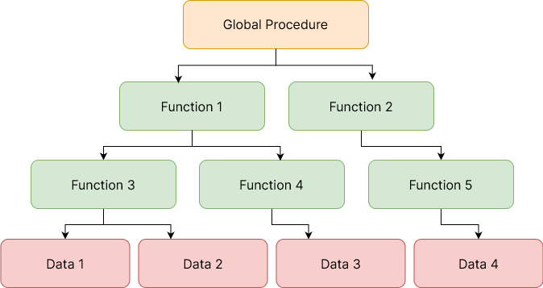

## Definition

Object-oriented programming (OOP) is a programming paradigm of structuring and organizing software programs as objects. In OOP, these objects are instances of classes, which serve as blueprints defining the attributes and behaviors.

In the past, programs were structured in a procedural format. This meant breaking down a program into smaller tasks or functions, following a top-down approach. Procedures operated on global data, and information flowed between them.

_Here's a diagram to illustrate the procedural approach:_


With OOP, instead of procedures or tasks, it employs objects—entities that have behaviors, holding information, data, and can interact with other objects. This new concept makes designing programs more natural and easier to reason about and understand.

It is important to note that OOP concepts can be employed in many other programming languages, however, support for these concepts may differ from languages that actively support it. These languages treat everything as objects, and are referred to as "Object-oriented" programming languages. Common examples include Java, C++, Python, Ruby, C#, and JavaScript.

## Structure of Object-oriented Programming

Objects in OOP model real-world entities people interact with, for example a motor vehicle. Suppose a program deals with motor vehicles like cars, trucks, and motorcycles, the program could use a class named Vehicle to represent the types of vehicles.

A vehicle in this sense is a class that provides the characteristics of a movable propulsion machine. There are different kinds of vehicles(objects) that have different properties like size, speed, engine type(attributes), and they ultimately perform numerous functionalities(methods).

Here's a class diagram to illustrate this concept better:

## Encapsulation

Encapsulation is a programming concept in object-oriented programming that refers to bundling or binding of data and methods within a single uint (within a class); It can also be said to be a projective shield that prevents the data from being accessed outisde it's shield.

In Java, encapsulation can be achieved by declaring the instance variables of a class as private, which means they can only be accessed within the class.

## Importance of Encapsulation

- Better control of class attributes and methods
- Class attributes can be made read-only or write-only
- It makes Java very flexible by changing one part of the code without affecting other part.

To protect data in encapsulation, the data must be private and only accessed through methods.

Here's an example code that creates public class variables that can be accessed within another class.

```java
public class Employee {
  String name;
  int age;
  int salary;
}
```

Since these are non-static variables, accessing them will require creating an object to access them within another class. In this case, "main".

```java
public class Main {
  public static void main(String[] args) {
    Employee emp = new Employee();
    emp.name = "John Doe";
    emp.age = 22;
    emp.salary = 1800;
  }
}
```

However, the variables of the Employee class are not encapsulated because they are directly accessible from the class. As stated earlier, these variables need to be marked with private modifiers to be encapsulated, and to modify these values, we'll utilize getters and setter methods.

```java
public class Employee {
  private String name;
  private int age;
  private int salary;

  // Name
  public String getName() {
    return name;
  }
  public void setName(String name) {
    this.name = name;
  }

  // Id
  public int getId() {
    return id;
  }
  public void setId(int id) {
    this.id = id;
  }

  // Salary
  public int getSalary() {
    return salary;
  }
  public void setSalary(int salary) {
    this.salary = salary;
  }
}
```

```java
public class Main {
  public static void main(String[] args) {
    Employee emp = new Employee();

    emp.setName("John Doe");
    emp.setId(104);
    emp.setSalary(150000);

    System.out.prinln("My name is " + emp.getName())
    System.out.prinln("My id is " + emp.getId())
    System.out.prinln("My salary is " + emp.getSalary())
  }
}
```

## Constructors

Constructors are special type of methods used for creating new objects. When you create a new class, Java assumes you want to create a constructor from that class, and automatically assigns a `no args` parameter to the constructor but you can update the parameters of the constructor by passing in a custom parameter or using getter and setter methods.

```java
public class Dogs {
  String name;
  int age;

  // Default no-args constructor.
  public Dogs() {}

  // Constructor with parameters for different values
  public Dogs(String name, int age) {
    this.name = name; // Assign the class variables to the constructor parameter values
    this.age = age;
  }
}
```

We can then access these values by passing in the arguments into the constructor object.

```java
public class Main {
  public static void main(String[] args) {
    Dog dog1 = new Dog("Bruno", 33);
    System.out.println("Name " + dog1.age + " Age " + dog1.age)

    Dog dog2 = new Dog("Matthew", 16);
    System.out.println("Name " + dog2.age + " Age " + dog2.age)
  }
}
```

## OOP Paradigms

A class represents a set of objects that share the same structure and behaviours. It determines the structure of objects by specifying variables that are contained in each instance of the class, and it determines behaviour by providing the instance methods that express the behaviour of the object.

In terms of OOP, a new idea is introduced that allows classes to express the similarities among objects that share some, but not all, of their structure and behavior, using inheritance and polymorphism.

In the realm of Java, understanding key concepts like Inheritance, Polymorphisim, and interfaces is crucial for developers to effectively design and implement robust and maintainable software systems.

### Inheritance

Inheritance allows the creation of new classes from already existing ones, enabling code reuse, and promoting a hierarchical structure. This approach offers numberous benefits, including reduced code duplication, enhanced modularity, and improved scalability.

The class that does the inheriting is said to be a `subclass` of the class from which it inherits. If class B is a `subclass` of class A, class A is said to be a `superclass` of B.

Syntax to create a subclass `B` from a superclass `A`:

```java
class B extends A {
  // additions to, and modifications of inherited elements from class A
}
```

### Example:

Suppose a program deals with motor vehicles like cars, trucks, and motorcycles, the program could use a class named `Vehicle` to represent all types of vehicles.

```java
Vehicles
  Car
  Truck
  Motorcycle
```

The `Vehicles` class would include instance variables such as `registrationNumber` and `owner`, or instance methods such as `transferOwnership()`

The three subclasses of `Vehicle`, `Car`, `Truck`, and `Motorcycle` could then hold variables and methods specific to particular types of vehicles.

For example, the `Car` class might add an instance variable, `numberOfDoors`, the `Truck` class might have `numberOfAxles`, and the `Motorcycle` class could have a boolean variable, `hasSidecar`

### Code Output

```java
class Vehicles {
  int registrationNumber;
  Person owner; // Assuming a Person class has been defined

  void transferOwnership(Person newOwner) {
    // transfer vehicle to newOwner
  }
}

class Car extends Vehicles {
  int numberOfDoors;
}

class Truck extends Vehicles {
  int numberOfAxles;
}

class Motorcycle extends Vehicles {
  boolean hasSidecar;
}
```

Suppose that `myCar` is a variable of type `Car` that has been declared and initialized with the statement:

```java
Car myCar = new Car();
```

Given this declaration, a program could refer to `myCar.numberOfDoors`, since `numberOfDoors` is an instance variable in the class `Car`. But since class `Car` extends class `Vehicle`, a car also has all the structure and behavior of a vehicle. This means that `myCar.registrationNumber`, `myCar.owner`, and `myCar.transferOwnership()` also exist.

> **NOTE**:
> A variable that can hold a reference to an object of class A can also hold a reference to an object belonging to any subclass of A.

```java
Vehicle myVehicle = myCar; or
Vehicle myVehicle = new Car();
```

To test whether a given object belongs to a given class, you can use the `instaceof` operator.

```java
myVehicle instanceof Car;
```

### Code Example

```java
system.out.println("Vehicle Data:")
system.out.println("Registration Number: " + myVehicle.registrationNumber);

if(myVehicle instanceof Car) {
  System.out.println("Type of vehicle: Car");
  Car myCar;
  myCar = (Car)myVehicle // Typecast to get access to numberOfDoors
  System.out.println("Number of doors: " + )
} else if (myVehicle instanceof Truck) {
  System.out.println("Type of Vehicle: Truck");
  Tuck myTruck;
  myTruck = (Truck)myVehicle // Type-cast to get access to numberOfAxles!
  System.out.println("Number of axles: " + myTruck.numberOfAxles);
} else if(myVehicle instanceof Motorcycle) {
  System.out.println("Type of Vehicle: Motorcycle");
  Motorcycle myCycle;
  myCycle = (Motorcycle)myVehicle // Type-cast to get access to hasSideCar
  System.out.println("Has a sidecar " + myVehicle.hasSidecar);
}
```

### Polymorhphism

The word polymorphism means "many forms". In Java it allows classes to take on multiple forms, enabling flexible and extensible programming. Through method overloading, developers can define multiple methods with the same name but different parameters, enhancing code readability and facilitating code maintenance.

For example, an `Animal` class contains instance variables for holding values like, `name` and `age`, and a `Dog` class is extended from the `Animal` superclass, inheriting the variables inside `Animal`.

## Types of Polymorphism

```java
// Animal class
public class Animal {
  String name;
  int age;

  public void sound() {
    System.out.println("Animal makes sound")
  }
}

// Dog class
public class Dog extends Animal {
  // Contains name, age and sound method from extending the animal class.
}

// Main class
public class Main {
  public static void main (String[] args) {
    Animal myAnimal = new Animal();

    myAnimal.sound() // Prints "Animal makes sound" since animal has the sound() method
    Dog myCat = new Dog();

    myCat.sound() // prints "Animal makes sound" as well, since Dog class extends the Animal class
  }
}
```

### Runtime Polymorphism (Method Overriding):

Even though the `Dog` class contains the `sound()` method without having to do anything, by default it will have the exact same behaviour with other animals. To resolve this, we need to override the `sound()` method from the parent `Animal` class.

To do this, you need to create a direct copy of the method in the `Animal` class and pass in the custom property. Here's an example that changes the animal sound for a `Cat` class.

```java
public class Cat extends Animal {
  // Contains name, age and sound method from extending the animal class.
  public void sound() {
    System.out.println("Cat meows");
  }
}
```

Now when the Cat object is created and the `cat.sound()` method is called, we get a different output:

```java
public class Main {
  public static void main(String[] args) {
    Cat myCat = new Cat();
    myCat.sound() // returns "Cat meows" instead of the generic "Animal makes sound"
  }
}
```

### Interfaces

This serve as contracts that define a set of methods that a class must implement. Interfaces promote abstraction, flexibilit, and reusability

### Extending Exisiting Classes

Subclassing is used mainly for extending a class to make a subclass. This adapts an existing class with a few changes or additions.

```java
public class <subclass-name> extends <existing class-name> {
  // Changes and additions
}
```

## DF POST

```java
public class Animal {
  String name;
  int age;

  public void getSound() {
    System.out.println("Animal sound")
  }

  public void setName(String name) {
    this.name = name;
  }
}

// Extend Dog and Cat clas with Animal
public class Dog extends Animal {}
public class Cat extends Animal {}

public class Main {
  public static void main(String[] args) {
    Dog myDog = new Dog();
    Cat myCat = new Cat();

    myDog.getSound() // Returns "Animal sound"
    myCat.getSound() // Returns "Animal sound"
  }
}

// Overriding Method
public class Dog extends Animal {
  public void getSound() {
    System.out.println("Dog Barks")
  }
}
public class Cat extends Animal {
  public void getSound() {
    System.out.println("Cat Meows")
  }
}
```
