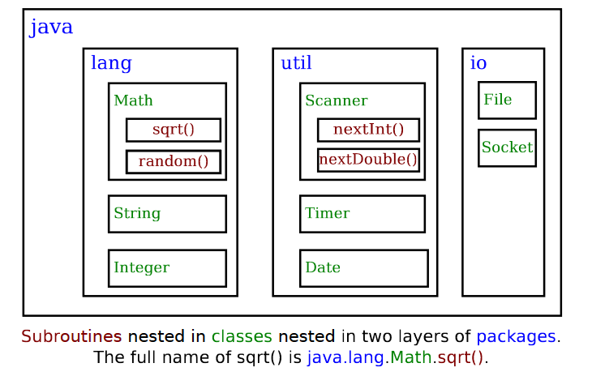

## Packages
A package is a way to bundle together related classes, subpackages, and interfaces. to create
well-organized, modular, and scalable applications.

## How Packages Work
Packages are structured within directories.

## Built-in Packages
The Java language also contains built-in subroutines for example of mathematical equations.
For example: `Math.sqrt()`, `Math.PI`, even the `String` and `System.out.print()` routines are also
part of the Java Standard API.

Like all routines in Java, the routines in the standard API are grouped into classes.
To provide a larger scale organization, classes in Java can be grouped into packages.

A package can contain both classes and other packages. A package nested inside another package is 
called a subpackage. The `java` and `javax` packages both contain subpackages.
One of the subpackage of `java` is the `util` package, which contains a variety of classes like
`Scanner`


> Source: Introduction to Programming in Java

The standard Java API includes thousands of classes in hundreds of packages.
The documentation for the full list can be found [here](https://docs.oracle.com/javase/8/docs/api/)

## User-define Packages
These are packages created explicitly. Here are the steps to create one

- Create the directory to match the package name. Note: Nested directories will act
  as subpackages.
- Create the class you want inside the package directory
- Import the class using the package name to import whatever is required.

## Using Classes from Packages
In other to use a class stored inside a package, you can use the full name of the class
combined with the package name.

For example, suppose you want to access the `Color` class inside the 
`java.util` package, one way to do this is to specify the full name:

```java
java.awt.Color myColor; // Here java.util.Color is a type assigned to myColor variable
```

Another way is by importing the package at the top of the file and using the class alone.
```java
import java.awt.Color;
Color someColor;
```

There is a shortcut for importing all the classes from a given package by 
using a wildcard in the import:

```java
import java.awt.*;
```
The wildcards import only the class available in the package, it does not point to
subpackages.

The standard packages are always available to the programs you write. They do not
require importing. These packages are stored in different locations based on the 
version of Java you are using, but they will be part of the installed JDK.

Every class in Java is part of a package. If a class is not placed in a package,
it will be placed in a **default** package which has no name.

## Modules
Modules are collections of packages. This represents further containment
- Modules contain packages
- Packages contain classes
- Classes contain variables and subroutines

From Java 9, modules were introduced for a few reasons:
- To provide better access control. For example a public class defined 
in a specific module will only be available in that particular module unless imported
explicitly.
- For modularization. The JRE contains a huge collection of classes, with modularization,
a custom JRE can be created to contain only the necessary classes needed in a program. 
Although this is only relevant for large-scale applications.

## Javadoc
This is the system in which the Java APIs are documented.
Javadocs are prepared using the multi-line comments. But instead of single asterisk,
it uses double. Essentially: `/**  **/`

The rule to using javadoc is to place the comment just before the sub-routine
it is commenting on.

Javadoc comments can include special tags called doc tags. They include:
`@param 〈parameter-name 〉 〈description-of-parameter 〉`
`@return 〈description-of-return-value 〉`
`@throws 〈exception-class-name 〉 〈description-of-exception 〉`

Here's an example documentation of a subroutine:

```java
public class JavadocExample {
/**
 * This subroutine computes the area of a rectangle, given its width
 * and its height. The length and the width should be positive numbers.
 * @param width the length of one side of the rectangle
 * @param height the length the second side of the rectangle
 * @return the area of the rectangle
 * @throws IllegalArgumentException if either the width or the height
 * is a negative number.
 **/

    public static double areaOfRectangle( double length, double width ) {
        if ( width < 0 || height < 0 )
            throw new IllegalArgumentException("Sides must have positive length.");
        double area;
        area = width * height;
        return area;
    }
}
```

The Application Programming Interface or API is a collection of functionalities or subroutines
available in a toolbox. The API usually provides an interface through which a developer can access
the available subroutines and how to use them. For example, the Windows API is a collection
of subroutines in the Windows toolbox.